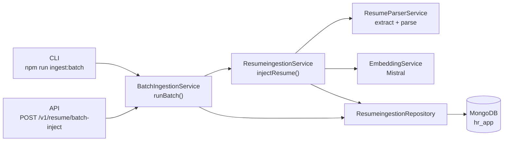
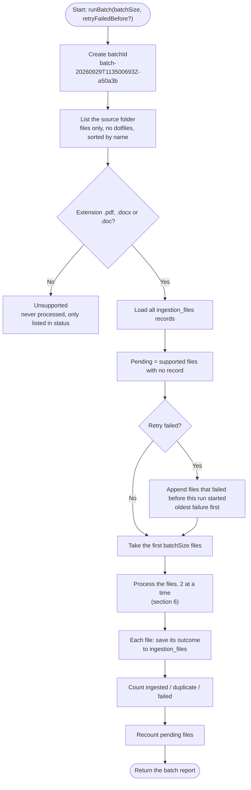
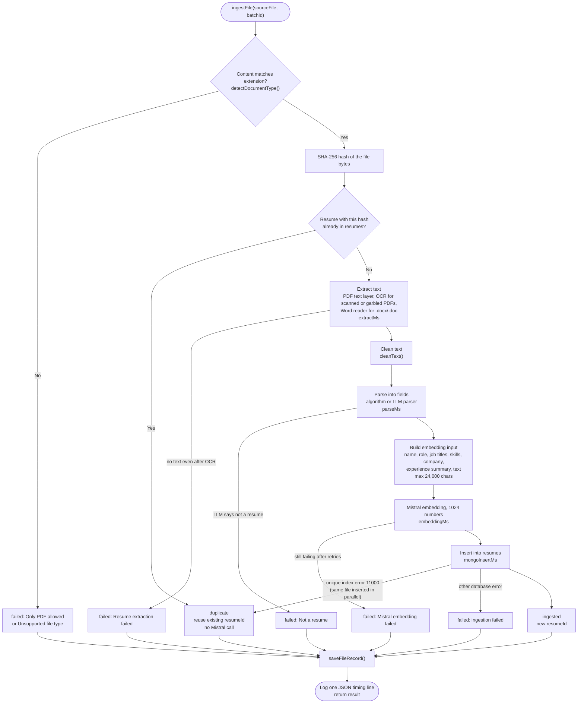
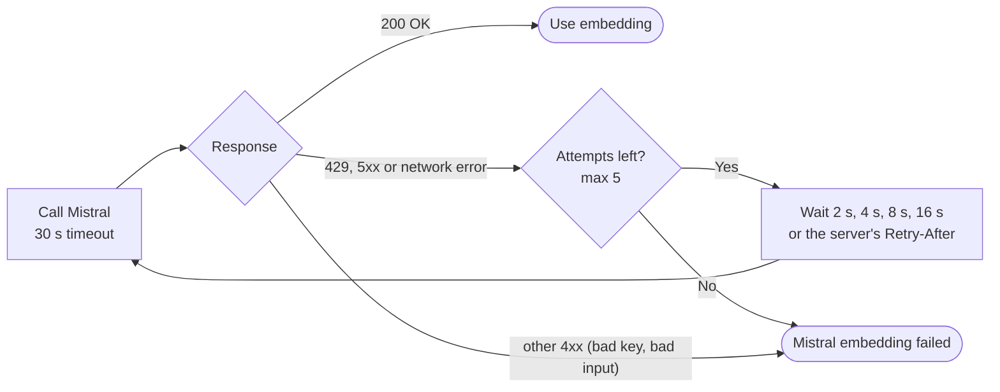
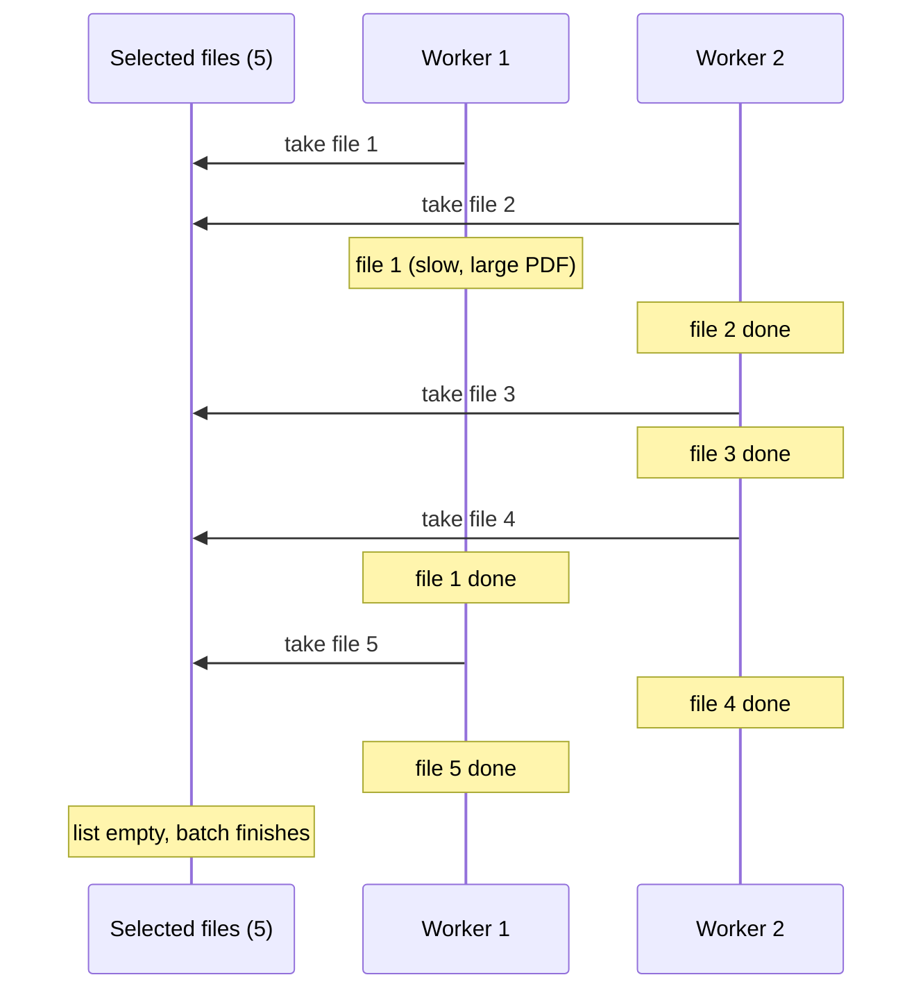
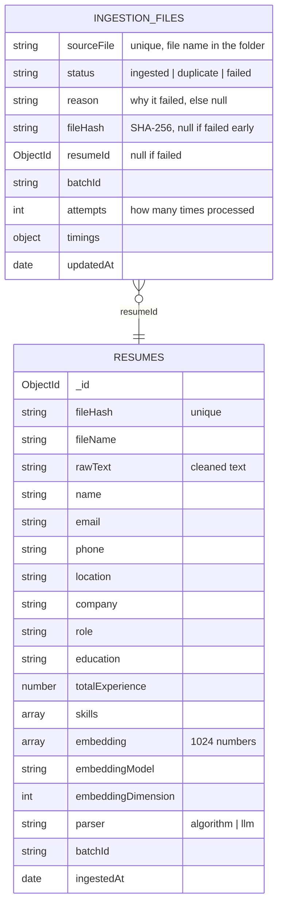
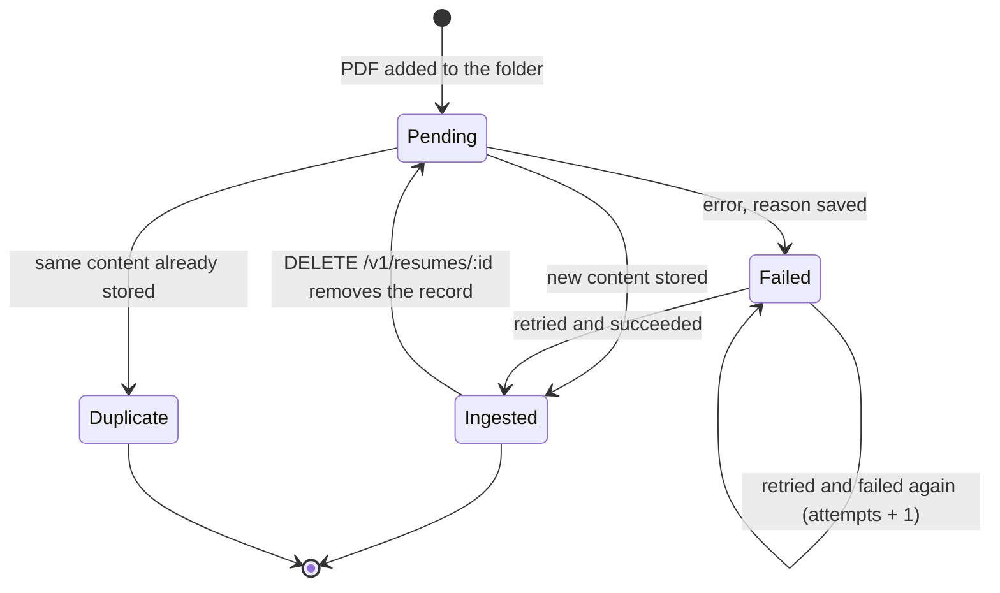
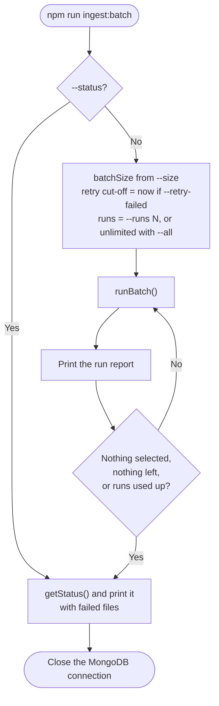

# Batch Resume Ingestion: How It Works

This document explains how the backend ingests many resumes from a folder in batches of 5 or 10: which code runs, in what order, and what is stored in MongoDB.

The diagrams use [Mermaid](https://mermaid.js.org/). GitHub renders them as pictures. In VS Code, install the "Markdown Preview Mermaid Support" extension to see them in the preview.

---

## 1. The idea in one picture

```text
 resumes/ folder                  BatchIngestionService                       MongoDB (hr_app)
 ┌──────────────┐                ┌──────────────────────────┐               ┌────────────────────┐
 │ a.pdf        │  list + sort   │ 1. find pending files    │  read records │ ingestion_files    │
 │ b.pdf        │ ─────────────► │ 2. take next 5 or 10     │ ◄──────────── │  one per file      │
 │ c.docx       │                │ 3. ingest 2 at a time    │               │  status / reason   │
 │ d.pdf        │                │ 4. save outcome per file │ ────────────► │                    │
 │ ...          │                │ 5. return a report       │               │ resumes            │
 └──────────────┘                └────────────┬─────────────┘  insert doc   │  parsed fields +   │
                                              │ ────────────────────────────► │  1024-d embedding  │
                                              ▼                               └────────────────────┘
                                 extract → clean → parse → embed → store
                                       (one resume = ResumeingestionService)
```

Every run picks up where the last one stopped. Each file gets a record in `ingestion_files` that says what happened to it, so files are not processed twice and any failure keeps its reason.

---

## 2. Code map

| Layer | File | Role |
|---|---|---|
| CLI entry point | [src/scripts/ingestBatch.ts](src/scripts/ingestBatch.ts) | `npm run ingest:batch`: runs one or more batches, prints reports |
| HTTP entry point | [src/controllers/ingestionController.ts](src/controllers/ingestionController.ts) | `POST /v1/resume/batch-inject`, `GET /v1/resume/batch-status` |
| Batch logic | [src/services/BatchIngestionService.ts](src/services/BatchIngestionService.ts) | Choose files, run them in parallel, record outcomes, report status |
| One-resume pipeline | [src/services/ResumeingestionService.ts](src/services/ResumeingestionService.ts) | Hash, extract, clean, parse, embed, insert |
| Embeddings | [src/services/EmbeddingService.ts](src/services/EmbeddingService.ts) | Mistral API call with retries |
| Database | [src/repositories/ResumeingestionRepository.ts](src/repositories/ResumeingestionRepository.ts) | `resumes` and `ingestion_files` collections |
| Connection | [src/config/db.ts](src/config/db.ts) | One shared MongoClient |



Both entry points call the same `runBatch()`, so the CLI and the API behave the same.

---

## 3. Configuration

All settings come from `.env`. The HTTP API never accepts a folder path, so a caller cannot make the server read arbitrary folders.

| Variable | Default | Meaning |
|---|---|---|
| `RESUME_SOURCE_DIR` | `resumes` | Folder with the source resumes (relative to the project root, or absolute) |
| `INGESTION_BATCH_SIZE` | `5` | Batch size when the request does not give one. Only 5 or 10 are allowed |
| `INGESTION_CONCURRENCY` | `2` | How many resumes are processed at the same time |
| `MONGODB_URI` / `MONGODB_DB` | `hr_app` | Where results are stored |
| `MISTRAL_API_KEY` | none | Needed for embeddings |
| `USE_LLM_PARSER` | `false` | `true` parses with the LLM, `false` with the algorithm parser |

---

## 4. Step by step: one batch run



### Step 1: Validate the batch size
`resolveBatchSize()` accepts only 5 or 10. Without a value it uses `INGESTION_BATCH_SIZE`. Anything else throws `InvalidBatchSizeError`, which the API returns as **400 "batchSize must be one of 5, 10"**.

### Step 2: Create a batch id
Each run gets an id such as `batch-20260929T113500693Z-a50a3b` (timestamp plus 6 random hex characters). It is stored on every resume and file record from that run, so you can find out which run handled a file.

### Step 3: List the folder
`listFiles()` reads the folder, keeps regular files (no subfolders, no hidden files), and sorts them by name. Sorting keeps the order stable, so batch 2 always continues where batch 1 stopped. Files are split into:
- **supported** (`.pdf`, `.docx`, `.doc`): candidates for ingestion;
- **unsupported** (anything else): reported in status, never processed.

### Step 4: Find pending files
`pendingFiles()` compares the supported files with the records in `ingestion_files`:
- a PDF **with no record** is new, so it is pending;
- a PDF **with a record** has been handled (ingested, duplicate or failed) and is skipped.

With "retry failed", files whose last attempt failed **before this run started** are added after the new ones, oldest failure first. The cut-off time matters: a file that fails again during the run gets a newer timestamp, so `--all --retry-failed` retries each failed file once instead of looping forever on files that can never succeed.

### Step 5: Select the batch
The first `batchSize` pending files are selected (`pending.slice(0, batchSize)`).

### Step 6: Process the files in parallel
Each selected file goes through `ingestFile()` with at most `INGESTION_CONCURRENCY` (default 2) in flight. See section 6.

### Step 7: Record each outcome
After each file, `saveFileRecord()` upserts its `ingestion_files` record (by file name). It sets the status, reason, hash, resume id, batch id, timings and `updatedAt`, and increases `attempts` by 1.

### Step 8: Build the report
The report counts the outcomes, recounts pending files, and includes per-file details:

```json
{
  "batchId": "batch-20260929T113500693Z-a50a3b",
  "batchSize": 5,
  "selected": 5,
  "ingested": 3,
  "duplicate": 1,
  "failed": 1,
  "remainingPending": 120,
  "durationMs": 8421,
  "files": [
    {
      "sourceFile": "Abish - Marketing (1).pdf",
      "status": "ingested",
      "reason": null,
      "resumeId": "6abba26630d73b659c4f1cf8",
      "timings": { "extractMs": 85, "parseMs": 12, "embeddingMs": 640, "mongoInsertMs": 95 }
    },
    {
      "sourceFile": "Vijay.pdf",
      "status": "failed",
      "reason": "Resume extraction failed",
      "resumeId": null,
      "timings": {}
    }
  ]
}
```

---

## 5. Step by step: one file

`ingestFile()` wraps the single-resume pipeline `ResumeingestionService.injectResume()`. The pipeline is the same one used by `POST /v1/resume/inject` for single uploads.



### Details of each step

| # | Step | Code | Notes |
|---|---|---|---|
| 1 | Type check | `detectDocumentType()` | Reads the first bytes: `%PDF-` for PDF, a ZIP header for `.docx`, an OLE header for `.doc`, or HTML (job portals save some resumes as HTML named `.doc`). A renamed `.txt` fails here |
| 2 | Hash | `crypto.createHash("sha256")` | The hash identifies the content, not the name. `X.pdf` and `X (1).pdf` with the same bytes have the same hash |
| 3 | Duplicate check | `findResumeIdByHash()` | If found, the file is `duplicate` and no Mistral call is made |
| 4 | Extract | `resumeParserService.extractText()` | PDF text layer; scanned PDFs (no text) and PDFs with broken font maps are OCR'd with tesseract.js (first 5 pages). Word files use word-extractor. Fails with "Resume extraction failed" only if no text is found at all |
| 5 | Clean | `cleanText()` | Removes extra whitespace and special symbols |
| 6 | Parse | `getResumeParser().parseResume()` | name, email, phone, location, company, role, jobTitles, education, totalExperience, experienceSummary, skills. With `USE_LLM_PARSER=true`, documents that are not resumes (offer letters, job descriptions, ID cards) fail with "Not a resume" |
| 7 | Embed | `embeddingService.generateEmbedding()` | Retries (see below), checks that the vector has 1024 numbers |
| 8 | Store | `insertResume()` | Unique index on `fileHash` makes a double insert impossible |
| 9 | Record | `saveFileRecord()` | Always runs, also for failures |
| 10 | Log | `console.log(JSON.stringify(...))` | Phase 13 format: `requestId`, `fileName`, timings |

### Why one failure does not stop the batch
`ingestFile()` catches every error from the pipeline and turns it into a `failed` result with a `reason`. The other files in the batch continue. The reason is stored, for example:

```text
Resume extraction failed
Mistral embedding failed: Mistral API 429: {"message":"Requests rate limit exceeded"}
```

### Embedding retries
Mistral can return "rate limit" errors when many resumes are embedded quickly. `EmbeddingService` retries:



---

## 6. Parallel processing

`mapWithConcurrency()` starts `INGESTION_CONCURRENCY` workers. Each worker takes the next file from a shared list until the list is empty, so a slow file never blocks the others. Results keep the original file order.



Why only 2: each file calls Mistral, and higher parallelism mostly produces more rate-limit errors. Raise `INGESTION_CONCURRENCY` only if your Mistral plan allows more requests.

---

## 7. What is stored



- **`resumes`** holds one document per unique resume content.
- **`ingestion_files`** holds one record per source file. Several file records can point to the same resume: one `ingested` and the others `duplicate`.

Indexes are created automatically the first time the repository is used: unique `resumes.fileHash`, unique `ingestion_files.sourceFile`, and `ingestion_files.status`.

### Life of a file record



---

## 8. Checking the result: batch status

`getStatus()` (CLI `--status`, API `GET /v1/resume/batch-status`) compares the folder with the database:

| Field | Meaning |
|---|---|
| `supportedFiles` | `.pdf`, `.docx` and `.doc` files in the folder |
| `pdfFiles` / `wordFiles` | The same, split by type |
| `unsupportedFiles` | Other files, listed by name |
| `ingested` / `duplicate` / `failed` | Records for supported files that are still in the folder |
| `pending` | Supported files with no record yet |
| `resumesInDb` | All documents in `resumes` |
| `resumesFromBatches` | Documents in `resumes` created by a batch run |
| `consistent` | Checks that the database matches the records (below) |
| `failures` | Each failed file with its reason |

`consistent` is `true` when all three hold:
1. every `ingested` record has a `resumeId`;
2. every one of those ids exists in `resumes`;
3. the number of batch-created resumes equals the number of `ingested` records.

It turns `false` when, for example, a resume was deleted directly in MongoDB, or `RESUME_SOURCE_DIR` points to a folder other than the one the resumes came from.

Rule of thumb: **`ingested + duplicate + failed + pending = supportedFiles`**.

Status of the full `resumes/` folder after all runs:

| | Count |
|---|---|
| PDFs | 180 |
| Ingested | 151 |
| Duplicate | 16 |
| Failed (scanned PDFs, no text) | 13 |
| Pending | 0 |
| Not PDF (skipped) | 19 |
| `consistent` | true |

---

## 9. Running it

### Command line

```bash
npm run ingest:batch -- --size 5              # one batch of 5
npm run ingest:batch -- --size 10 --runs 3    # three batches of 10
npm run ingest:batch -- --size 10 --all       # until nothing is pending
npm run ingest:batch -- --retry-failed        # also retry failed files once
npm run ingest:batch -- --status              # only show the status
```



### API

```http
POST http://localhost:3000/v1/resume/batch-inject
Content-Type: application/json

{ "batchSize": 5, "retryFailed": false }
```

```http
GET http://localhost:3000/v1/resume/batch-status
```

| Case | Response |
|---|---|
| Files processed | 200, "Batch processed: 5 file(s)" with the report |
| Nothing pending | 200, "No pending resumes to ingest", `selected: 0` |
| `batchSize` not 5 or 10 | 400, "batchSize must be one of 5, 10" |
| MongoDB unreachable | 500, "ingestion failed" |

One API call runs one batch. To ingest a whole folder, use the CLI with `--all`, or send the request repeatedly until it returns "No pending resumes to ingest".

---

## 10. Design decisions

| Decision | Reason |
|---|---|
| Fixed batch sizes (5 or 10) | Predictable run time and Mistral usage per request |
| A record for every file, failures included | Runs can be stopped and resumed, and nothing fails silently |
| Duplicates detected by content hash, not name | Copies such as `X.pdf` and `X (1).pdf` are stored once, without a second Mistral call |
| Unique index on `fileHash` | Two workers handling identical files at the same moment cannot both insert |
| Files sorted by name | The order is the same on every run |
| Limited parallelism (2) | Faster than one at a time without hitting Mistral rate limits |
| Retry cut-off at run start | `--all --retry-failed` retries each failure once instead of looping |
| Folder only from `.env` | API callers cannot point the server at other folders |
